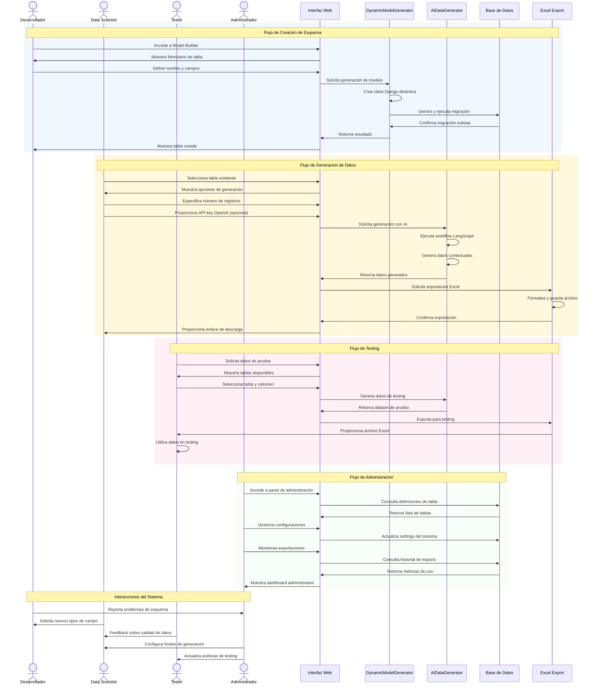

# **Dynamic Model Builder - Synthetic Data Generation Platform**

---

## **1. Introducción al Proyecto**

### **1.1 Contexto del Caso de Estudio**
En la era del Big Data y el Machine Learning, la **generación de datos sintéticos de alta calidad** se ha convertido en un componente esencial para el desarrollo y testing de aplicaciones. El proyecto **Dynamic Model Builder** aborda el desafío crítico de crear datasets realistas para desarrollo, testing y análisis de datos sin comprometer la privacidad ni requerir acceso a datos sensibles.

Los métodos tradicionales de generación de datos de prueba basados en scripts manuales o datos estáticos han demostrado ser **ineficientes, poco realistas y difíciles de mantener**. Estos problemas afectan directamente la calidad del desarrollo de software, la validación de modelos de ML y la capacidad de escalar proyectos de datos.

### **1.2 Justificación del Proyecto**
La implementación de una plataforma de generación de datos sintéticos aporta beneficios significativos en múltiples áreas:

1. **Eficiencia en Desarrollo:**
   - Eliminación de dependencias de datos reales para testing
   - Aceleración de ciclos de desarrollo y testing
   - Reducción de costos asociados a preparación de datos

2. **Calidad de Datos:**
   - Generación de datos realistas con Faker library
   - Integración de IA para datos contextuales específicos
   - Validación automática de constraints y formatos

3. **Escalabilidad y Flexibilidad:**
   - Creación dinámica de esquemas de base de datos
   - Soporte para múltiples tipos de datos y formatos
   - Arquitectura modular para extensiones futuras

La plataforma busca no solo **resolver los problemas actuales** de generación de datos, sino también **posicionar al proyecto como referente** en la generación inteligente de datos sintéticos.

### **1.3 Propósito del Sistema**
El propósito del sistema es **desarrollar una plataforma web completa** que permita a desarrolladores, data scientists y testers crear bases de datos dinámicas con datos sintéticos realistas, integrando capacidades de IA para generación contextual y exportando resultados en formatos profesionales.

---

## **2. Objetivos del Proyecto**

### **2.1 Objetivo General**
Desarrollar una **plataforma web integral de generación de datos sintéticos** que permita crear esquemas de base de datos dinámicos, generar datos realistas con capacidades de IA y exportar resultados en formatos profesionales, mejorando la eficiencia en desarrollo y testing de aplicaciones.

### **2.2 Objetivos Específicos (SMART)**

| **Objetivo**                                                                 | **Medición**                              | **Plazo**          |
|------------------------------------------------------------------------------|-------------------------------------------|--------------------|
| Integrar IA para generación contextual de datos específicos.                 | **80% de precisión** en datos contextuales.| 4 meses.           |
| Desarrollar sistema de exportación Excel profesional.                        | Archivos con **formato empresarial**.     | 2 meses (MVP).     |
| Crear interfaz web intuitiva sin requerir conocimientos técnicos.            | **Tiempo de onboarding < 30 min**.        | 3 meses.           |
| Desarrollar arquitectura modular extensible para nuevos tipos de datos.      | **Facilidad de extensión > 8/10**.        | 4 meses.           |

---

## **3. Arquitectura del Sistema**

### **3.1 Patrón Arquitectónico Principal**
El sistema implementa una **arquitectura MVC (Model-View-Controller) con Service Layer**, siguiendo las mejores prácticas de Django y patrones de diseño modernos.

```python
# Arquitectura en Capas:
┌─────────────────┐    ┌──────────────────┐    ┌─────────────────┐
│   Templates     │    │     Views        │    │   Services      │
│   (Presentation)│◄──►│  (Controllers)   │◄──►│  (Business      │
│                 │    │                  │    │    Logic)       │
└─────────────────┘    └──────────────────┘    └─────────────────┘
                              │
                              ▼
                       ┌──────────────────┐
                       │    Models        │
                       │   (Data Layer)    │
                       └──────────────────┘
```

### **3.2 Componentes Arquitectónicos Principales**

#### **3.2.1 Capa de Presentación (Frontend)**
- **Framework**: Bootstrap 5 + HTMX + Vanilla JavaScript
- **Características**:
  - Interfaz responsive y moderna
  - Formularios dinámicos con HTMX
  - Validación en tiempo real
  - Experiencia de usuario intuitiva

#### **3.2.2 Capa de Aplicación (Backend)**
- **Framework**: Django 5.2.5
- **Componentes**:
  - **Views**: Controladores de la lógica de presentación
  - **Models**: Definición de datos y metadata
  - **Services**: Lógica de negocio especializada

#### **3.2.3 Capa de Servicios (Business Logic)**
- **DynamicModelGenerator**: Generador de modelos Django en runtime
- **AIDataGenerator**: Servicio de IA con LangChain/LangGraph
- **Excel Export Service**: Generación de archivos Excel profesionales

#### **3.2.4 Capa de Datos**
- **ORM**: Django ORM con SQLite (configurable)
- **Dynamic Tables**: Tablas creadas dinámicamente por usuarios
- **Metadata Storage**: Almacenamiento de definiciones y exportaciones

### **3.3 Arquitectura de Generación Dinámica**

#### **3.3.1 Patrón Factory para Modelos**
```python
# Flujo de Generación Dinámica:
User Input → Field Definitions → Django Model Class → Migration → Database Table
```

#### **3.3.2 Sistema de Migraciones Automáticas**
- Generación automática de archivos de migración
- Ejecución segura con manejo de errores
- Rollback automático en caso de fallos

#### **3.3.3 Arquitectura de IA Integrada**
```python
# Workflow de LangGraph:
DataGenerationState → Analyze → Generate → Validate → Output
```

---

## **4. Análisis de Requisitos Técnicos**

### **4.1 Requisitos Funcionales**

| **ID** | **Requisito Funcional**                                              | **Prioridad** |
|--------|----------------------------------------------------------------------|---------------|
| RF-01  | Crear esquemas de base de datos dinámicos vía interfaz web.          | Alta          |
| RF-02  | Generar modelos Django automáticamente con 11 tipos de campos.       | Alta          |
| RF-03  | Ejecutar migraciones de base de datos de forma automática.           | Alta          |
| RF-04  | Generar datos sintéticos con Faker library.                          | Alta          |
| RF-05  | Integrar IA para generación contextual de datos específicos.         | Media         |
| RF-06  | Exportar datos a archivos Excel con formato profesional.             | Alta          |
| RF-07  | Gestionar historial de exportaciones y definiciones de tablas.       | Media         |
| RF-08  | Proporcionar interfaz de administración Django completa.            | Media         |
| RF-09  | Implementar sistema de validación de constraints.                    | Alta          |
| RF-10  | Gestionar errores y fallbacks en generación de datos.                | Alta          |

### **4.2 Requisitos No Funcionales**

| **ID** | **Requisito No Funcional**                  | **Descripción**                                                       |
|--------|--------------------------------------------|-----------------------------------------------------------------------|
| RNF-01 | Rendimiento                                | Generación de hasta **10,000 registros** en < 30 segundos.            |
| RNF-02 | Disponibilidad                             | Plataforma web con **99.5% uptime** en desarrollo.                    |
| RNF-03 | Seguridad                                  | Protección CSRF, validación de inputs, sanitización de datos.         |
| RNF-04 | Escalabilidad                              | Soporte para **100+ tablas dinámicas** simultáneas.                  |
| RNF-05 | Usabilidad                                 | Interfaz intuitiva sin conocimientos técnicos requeridos.            |
| RNF-06 | Mantenibilidad                             | Arquitectura modular con separación clara de responsabilidades.       |
| RNF-07 | Extensibilidad                             | Fácil adición de nuevos tipos de campos y generadores.                |
| RNF-08 | Compatibilidad                             | Funcionamiento en Python 3.8+ y navegadores modernos.                 |

### **4.3 Requisitos de Integración**

| **ID** | **Servicio Externo** | **Propósito**                          | **Prioridad** |
|--------|---------------------|----------------------------------------|---------------|
| RI-01  | OpenAI API         | Generación contextual con IA           | Media         |
| RI-02  | Faker Library      | Generación de datos realistas          | Alta          |
| RI-03  | OpenPyXL           | Exportación a Excel                    | Alta          |
| RI-04  | LangChain          | Framework de IA y prompts              | Media         |
| RI-05  | LangGraph          | Workflows de generación de datos       | Media         |

---

## **5. Stack Tecnológico**

### **5.1 Tecnologías Core**

| **Categoría**      | **Tecnología**          | **Versión** | **Propósito**                          |
|-------------------|------------------------|-------------|----------------------------------------|
| **Backend**       | Django                | 5.2.5      | Framework web principal                |
| **Lenguaje**      | Python               | 3.13+      | Lenguaje de programación               |
| **Base de Datos** | SQLite               | 3.x        | Base de datos (configurable)           |
| **ORM**           | Django ORM           | -          | Mapeo objeto-relacional               |

### **5.2 Tecnologías de IA y Datos**

| **Categoría**      | **Tecnología**          | **Versión** | **Propósito**                          |
|-------------------|------------------------|-------------|----------------------------------------|
| **IA Framework**  | LangChain             | 0.3.14     | Integración con modelos de IA          |
| **Workflows**     | LangGraph             | 0.2.51     | Orquestación de flujos de IA           |
| **IA Provider**   | OpenAI API            | 1.58.1     | Servicio de IA para generación         |
| **Data Generation**| Faker                | 37.5.3     | Generación de datos sintéticos         |
| **Excel Export**  | OpenPyXL              | 3.1.5      | Creación de archivos Excel             |

### **5.3 Tecnologías Frontend**

| **Categoría**      | **Tecnología**          | **Versión** | **Propósito**                          |
|-------------------|------------------------|-------------|----------------------------------------|
| **CSS Framework** | Bootstrap             | 5.1.3      | Framework de estilos responsive        |
| **JavaScript**    | Vanilla JS + HTMX     | -          | Interactividad y dinamismo             |
| **Icons**         | Font Awesome         | 6.0.0      | Iconografía de la interfaz             |

### **5.4 Tecnologías de Desarrollo**

| **Categoría**      | **Tecnología**          | **Versión** | **Propósito**                          |
|-------------------|------------------------|-------------|----------------------------------------|
| **Gestión Dep.**  | pip + requirements.txt| -          | Gestión de dependencias                |
| **Entorno Virtual**| venv                  | -          | Aislamiento de dependencias            |
| **Configuración** | python-decouple       | 3.8        | Gestión de variables de entorno        |
| **Extensions**    | Django Extensions     | 4.1        | Utilidades adicionales de Django       |

---

## **6. Arquitectura de Datos**

### **6.1 Modelo de Datos Estáticos**

```python
# Modelos Core del Sistema
class DynamicTableDefinition(models.Model):
    """Almacena definiciones de tablas dinámicas"""
    table_name = models.CharField(max_length=100, unique=True)
    display_name = models.CharField(max_length=200)
    description = models.TextField(blank=True)
    fields_definition = models.JSONField()
    is_migrated = models.BooleanField(default=False)
    created_at = models.DateTimeField(auto_now_add=True)

class DynamicTableExport(models.Model):
    """Registra exportaciones de datos"""
    table_definition = models.ForeignKey(DynamicTableDefinition, on_delete=models.CASCADE)
    num_records = models.PositiveIntegerField()
    status = models.CharField(max_length=20, choices=STATUS_CHOICES)
    file_path = models.CharField(max_length=500, blank=True)
    created_at = models.DateTimeField(auto_now_add=True)
```

### **6.2 Modelo de Datos Dinámicos**

```python
# Ejemplo de Tabla Dinámica Generada:
class UserProfiles(models.Model):
    """Tabla generada dinámicamente"""
    id = models.AutoField(primary_key=True)
    first_name = models.CharField(max_length=50)
    last_name = models.CharField(max_length=50)
    email = models.EmailField()
    age = models.IntegerField()
    created_at = models.DateTimeField(auto_now_add=True)
```

### **6.3 Estrategia de Almacenamiento**

- **Metadata Tables**: Almacenan definiciones y configuraciones
- **Dynamic Tables**: Tablas creadas por usuarios con esquemas personalizados
- **File Storage**: Archivos Excel en directorio `output/`
- **Configuration**: Variables de entorno para settings sensibles

---

## **7. Casos de Uso del Sistema**

### **7.1 Diagrama de Secuencia del Sistema**



### **7.2 Flujos de Usuario Principales**

#### **7.2.1 Flujo de Creación de Tabla**
1. Usuario accede a interfaz de Model Builder
2. Define nombre y descripción de tabla
3. Agrega campos con tipos y constraints
4. Sistema genera modelo Django automáticamente
5. Se ejecuta migración de base de datos
6. Usuario confirma creación exitosa

#### **7.2.2 Flujo de Generación de Datos**
1. Usuario selecciona tabla existente
2. Especifica número de registros a generar
3. Opcionalmente configura API key de OpenAI
4. Sistema genera datos usando Faker + IA
5. Se crea archivo Excel con formato profesional
6. Usuario descarga archivo generado

---

## **8. Suposiciones y Restricciones**

### **8.1 Suposiciones del Proyecto**

- **Disponibilidad de APIs**: Acceso confiable a APIs de OpenAI (cuando se use IA)
- **Conocimientos Básicos**: Usuarios tienen conocimientos básicos de bases de datos
- **Entorno de Desarrollo**: Proyecto se ejecuta en entornos de desarrollo/testing
- **Conectividad**: Acceso a internet para dependencias externas
- **Hardware**: Servidor con recursos suficientes para procesamiento de datos

### **8.2 Restricciones Técnicas**

- **Límite de Registros**: Máximo 10,000 registros por exportación
- **Tipos de Base de Datos**: Optimizado para SQLite (configurable para PostgreSQL/MySQL)
- **Dependencias Externas**: Requiere conexión a internet para funcionalidades de IA
- **Navegadores Soportados**: Chrome, Firefox, Safari, Edge (versiones modernas)
- **Sistema Operativo**: macOS, Linux, Windows con Python 3.8+

### **8.3 Restricciones de Alcance**

- **Alcance MVP**: Funcionalidades core sin integración con sistemas externos
- **Idiomas**: Interfaz en inglés (preparado para internacionalización)
- **Autenticación**: Sistema básico de Django (sin OAuth avanzado)
- **Monitoreo**: Logging básico sin dashboards avanzados

---

## **9. Métricas de Éxito**

### **9.1 KPIs Técnicos**

| **Métrica**                          | **Valor Objetivo** | **Frecuencia** |
|--------------------------------------|-------------------|----------------|
| Tiempo de generación (1,000 regs)    | < 5 segundos     | Por exportación|
| Tasa de éxito de migraciones         | > 95%            | Por migración  |
| Disponibilidad del sistema           | > 99%            | Diario         |
| Satisfacción del usuario             | > 4.5/5          | Por trimestre  |

### **9.2 KPIs de Negocio**

| **Métrica**                          | **Valor Objetivo** | **Frecuencia** |
|--------------------------------------|-------------------|----------------|
| Tablas creadas por mes               | > 50             | Mensual        |
| Datasets exportados por mes          | > 200            | Mensual        |
| Tiempo de adopción por usuario       | < 30 minutos     | Por usuario    |
| Reducción en tiempo de desarrollo     | > 60%            | Por proyecto   |

---

## **10. Plan de Implementación**

### **10.1 Fases de Desarrollo**

#### **Fase 1: Core System (Meses 1-2)**
- Configuración base de Django
- Modelos estáticos y migraciones
- Interfaz básica de administración

#### **Fase 2: Dynamic Model Generation (Meses 2-3)**
- Implementación de DynamicModelGenerator
- Sistema de migraciones automáticas
- Validación de esquemas dinámicos

#### **Fase 3: Data Generation (Meses 3-4)**
- Integración con Faker library
- Sistema básico de generación de datos
- Exportación a Excel

#### **Fase 4: AI Integration (Meses 4-5)**
- Implementación de AIDataGenerator
- LangChain/LangGraph workflows
- OpenAI API integration

#### **Fase 5: UI/UX Enhancement (Meses 5-6)**
- Interfaz web completa con Bootstrap
- HTMX para dinamismo
- Testing y optimizaciones

### **10.2 Tecnologías de Deployment**

- **Contenedor**: Docker para aislamiento
- **Orquestación**: Docker Compose para desarrollo
- **Servidor**: Gunicorn para producción
- **Proxy**: Nginx para servir estáticos
- **Base de Datos**: PostgreSQL para producción

---

## **11. Conclusión**

La plataforma **Dynamic Model Builder** representa una solución innovadora para el desafío de generación de datos sintéticos en entornos de desarrollo y testing. Su arquitectura modular, integración con IA y enfoque en la experiencia del usuario la posicionan como una herramienta esencial para equipos de desarrollo modernos.

### **Beneficios Clave:**
- ✅ **Eliminación de dependencias** de datos reales
- ✅ **Generación inteligente** con capacidades de IA
- ✅ **Interfaz intuitiva** sin conocimientos técnicos
- ✅ **Arquitectura extensible** para futuras expansiones
- ✅ **Integración perfecta** con ecosistema Django

### **Impacto Esperado:**
La implementación exitosa de esta plataforma permitirá a los equipos de desarrollo **acelerar sus ciclos de trabajo**, **mejorar la calidad de testing** y **reducir costos asociados** a la preparación de datos de prueba, contribuyendo significativamente a la eficiencia general del proceso de desarrollo de software.

---

*Documento creado el: 28 de agosto de 2025*
*Versión: 1.0*
*Autor: Sistema de Análisis Arquitectónico*
