# **Dynamic Model Builder - Synthetic Data Generation Platform**

---

## **1. Introducción al Proyecto**

### **1.1 Contexto del Caso de Estudio**
En la era del Big Data y el Machine Learning, la **generación de datos sintéticos de alta calidad** se ha convertido en un componente esencial para el desarrollo y testing de aplicaciones. El proyecto **Dynamic Model Builder** aborda el desafío crítico de crear datasets realistas para desarrollo, testing y análisis de datos sin comprometer la privacidad ni requerir acceso a datos sensibles.

Los métodos tradicionales de generación de datos de prueba basados en scripts manuales o datos estáticos han demostrado ser **ineficientes, poco realistas y difíciles de mantener**. Estos problemas afectan directamente la calidad del desarrollo de software, la validación de modelos de ML y la capacidad de escalar proyectos de datos.


### **1.2 Justificación del Proyecto**
La implementación de una plataforma de generación de datos sintéticos aporta beneficios significativos en múltiples áreas:

1. **Eficiencia en Desarrollo:**
   - Eliminación de dependencias de datos reales para testing
   - Aceleración de ciclos de desarrollo y testing
   - Reducción de costos asociados a preparación de datos

2. **Calidad de Datos:**
   - Generación de datos realistas con Faker library
   - Integración de IA para datos contextuales específicos
   - Validación automática de constraints y formatos

3. **Escalabilidad y Flexibilidad:**
   - Creación dinámica de esquemas de base de datos
   - Soporte para múltiples tipos de datos y formatos
   - Arquitectura modular para extensiones futuras

La plataforma busca no solo **resolver los problemas actuales** de generación de datos, sino también **posicionar al proyecto como referente** en la generación inteligente de datos sintéticos.

### **1.3 Propósito del Sistema**
El propósito del sistema es **desarrollar una plataforma web completa** que permita a desarrolladores, data scientists y testers crear bases de datos dinámicas con datos sintéticos realistas, integrando capacidades de IA para generación contextual y exportando resultados en formatos profesionales.

---

## **2. Objetivos del Proyecto**

### **2.1 Objetivo General**
Desarrollar una **plataforma web integral de generación de datos sintéticos** que permita crear esquemas de base de datos dinámicos, generar datos realistas con capacidades de IA y exportar resultados en formatos profesionales, mejorando la eficiencia en desarrollo y testing de aplicaciones.

### **2.2 Objetivos Específicos (SMART)**

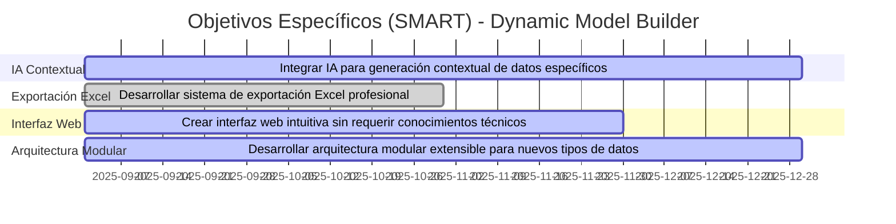
---

## **3. Arquitectura del Sistema**

### **3.1 Patrón Arquitectónico Principal**
El sistema implementa una **arquitectura MVC (Model-View-Controller) con Service Layer**, siguiendo las mejores prácticas de Django y patrones de diseño modernos.

```python
# Arquitectura en Capas:
┌─────────────────┐    ┌──────────────────┐    ┌─────────────────┐
│   Templates     │    │     Views        │    │   Services      │
│   (Presentation)│◄──►│  (Controllers)   │◄──►│  (Business      │
│                 │    │                  │    │    Logic)       │
└─────────────────┘    └──────────────────┘    └─────────────────┘
                              │
                              ▼
                       ┌──────────────────┐
                       │    Models        │
                       │   (Data Layer)    │
                       └──────────────────┘
```

### **3.2 Componentes Arquitectónicos Principales**

#### **3.2.1 Capa de Presentación (Frontend)**
- **Framework**: Bootstrap 5 + HTMX + Vanilla JavaScript
- **Características**:
  - Interfaz responsive y moderna
  - Formularios dinámicos con HTMX
  - Validación en tiempo real
  - Experiencia de usuario intuitiva

#### **3.2.2 Capa de Aplicación (Backend)**
- **Framework**: Django 5.2.5
- **Componentes**:
  - **Views**: Controladores de la lógica de presentación
  - **Models**: Definición de datos y metadata
  - **Services**: Lógica de negocio especializada

#### **3.2.3 Capa de Servicios (Business Logic)**
- **DynamicModelGenerator**: Generador de modelos Django en runtime
- **AIDataGenerator**: Servicio de IA con LangChain/LangGraph
- **Excel Export Service**: Generación de archivos Excel profesionales

#### **3.2.4 Capa de Datos**
- **ORM**: Django ORM con SQLite (configurable)
- **Dynamic Tables**: Tablas creadas dinámicamente por usuarios
- **Metadata Storage**: Almacenamiento de definiciones y exportaciones

### **3.3 Arquitectura de Generación Dinámica**

#### **3.3.1 Patrón Factory para Modelos**


#### **3.3.2 Sistema de Migraciones Automáticas**
- Generación automática de archivos de migración
- Ejecución segura con manejo de errores
- Rollback automático en caso de fallos

#### **3.3.3 Arquitectura de IA Integrada**
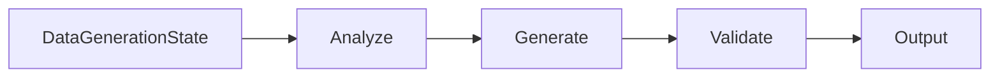

---

## **4. Análisis de Requisitos Técnicos**

### **4.1 Requisitos Funcionales**

| **ID** | **Requisito Funcional**                                              | **Prioridad** |
|--------|----------------------------------------------------------------------|---------------|
| RF-01  | Crear esquemas de base de datos dinámicos vía interfaz web.          | Alta          |
| RF-02  | Generar modelos Django automáticamente con 11 tipos de campos.       | Alta          |
| RF-03  | Ejecutar migraciones de base de datos de forma automática.           | Alta          |
| RF-04  | Generar datos sintéticos con Faker library.                          | Alta          |
| RF-05  | Integrar IA para generación contextual de datos específicos.         | Media         |
| RF-06  | Exportar datos a archivos Excel con formato profesional.             | Alta          |
| RF-07  | Gestionar historial de exportaciones y definiciones de tablas.       | Media         |
| RF-08  | Proporcionar interfaz de administración Django completa.            | Media         |
| RF-09  | Implementar sistema de validación de constraints.                    | Alta          |
| RF-10  | Gestionar errores y fallbacks en generación de datos.                | Alta          |

### **4.2 Requisitos No Funcionales**

| **ID** | **Requisito No Funcional**                  | **Descripción**                                                       |
|--------|--------------------------------------------|-----------------------------------------------------------------------|
| RNF-01 | Rendimiento                                | Generación de hasta **10,000 registros** en < 30 segundos.            |
| RNF-02 | Disponibilidad                             | Plataforma web con **99.5% uptime** en desarrollo.                    |
| RNF-03 | Seguridad                                  | Protección CSRF, validación de inputs, sanitización de datos.         |
| RNF-04 | Escalabilidad                              | Soporte para **100+ tablas dinámicas** simultáneas.                  |
| RNF-05 | Usabilidad                                 | Interfaz intuitiva sin conocimientos técnicos requeridos.            |
| RNF-06 | Mantenibilidad                             | Arquitectura modular con separación clara de responsabilidades.       |
| RNF-07 | Extensibilidad                             | Fácil adición de nuevos tipos de campos y generadores.                |
| RNF-08 | Compatibilidad                             | Funcionamiento en Python 3.8+ y navegadores modernos.                 |

### **4.3 Requisitos de Integración**

| **ID** | **Servicio Externo** | **Propósito**                          | **Prioridad** |
|--------|---------------------|----------------------------------------|---------------|
| RI-01  | OpenAI API         | Generación contextual con IA           | Media         |
| RI-02  | Faker Library      | Generación de datos realistas          | Alta          |
| RI-03  | OpenPyXL           | Exportación a Excel                    | Alta          |
| RI-04  | LangChain          | Framework de IA y prompts              | Media         |
| RI-05  | LangGraph          | Workflows de generación de datos       | Media         |

---

## **5. Stack Tecnológico**

### **5.1 Tecnologías Core**

| **Categoría**      | **Tecnología**          | **Versión** | **Propósito**                          |
|-------------------|------------------------|-------------|----------------------------------------|
| **Backend**       | Django                | 5.2.5      | Framework web principal                |
| **Lenguaje**      | Python               | 3.13+      | Lenguaje de programación               |
| **Base de Datos** | SQLite               | 3.x        | Base de datos (configurable)           |
| **ORM**           | Django ORM           | -          | Mapeo objeto-relacional               |

### **5.2 Tecnologías de IA y Datos**

| **Categoría**      | **Tecnología**          | **Versión** | **Propósito**                          |
|-------------------|------------------------|-------------|----------------------------------------|
| **IA Framework**  | LangChain             | 0.3.14     | Integración con modelos de IA          |
| **Workflows**     | LangGraph             | 0.2.51     | Orquestación de flujos de IA           |
| **IA Provider**   | OpenAI API            | 1.58.1     | Servicio de IA para generación         |
| **Data Generation**| Faker                | 37.5.3     | Generación de datos sintéticos         |
| **Excel Export**  | OpenPyXL              | 3.1.5      | Creación de archivos Excel             |

### **5.3 Tecnologías Frontend**

| **Categoría**      | **Tecnología**          | **Versión** | **Propósito**                          |
|-------------------|------------------------|-------------|----------------------------------------|
| **CSS Framework** | Bootstrap             | 5.1.3      | Framework de estilos responsive        |
| **JavaScript**    | Vanilla JS + HTMX     | -          | Interactividad y dinamismo             |
| **Icons**         | Font Awesome         | 6.0.0      | Iconografía de la interfaz             |

### **5.4 Tecnologías de Desarrollo**

| **Categoría**      | **Tecnología**          | **Versión** | **Propósito**                          |
|-------------------|------------------------|-------------|----------------------------------------|
| **Gestión Dep.**  | pip + requirements.txt| -          | Gestión de dependencias                |
| **Entorno Virtual**| venv                  | -          | Aislamiento de dependencias            |
| **Configuración** | python-decouple       | 3.8        | Gestión de variables de entorno        |
| **Extensions**    | Django Extensions     | 4.1        | Utilidades adicionales de Django       |

---

## **6. Arquitectura de Datos**

### **6.1 Modelo de Datos Estáticos**

```python
# Modelos Core del Sistema
class DynamicTableDefinition(models.Model):
    """Almacena definiciones de tablas dinámicas"""
    table_name = models.CharField(max_length=100, unique=True)
    display_name = models.CharField(max_length=200)
    description = models.TextField(blank=True)
    fields_definition = models.JSONField()
    is_migrated = models.BooleanField(default=False)
    created_at = models.DateTimeField(auto_now_add=True)

class DynamicTableExport(models.Model):
    """Registra exportaciones de datos"""
    table_definition = models.ForeignKey(DynamicTableDefinition, on_delete=models.CASCADE)
    num_records = models.PositiveIntegerField()
    status = models.CharField(max_length=20, choices=STATUS_CHOICES)
    file_path = models.CharField(max_length=500, blank=True)
    created_at = models.DateTimeField(auto_now_add=True)
```

### **6.2 Modelo de Datos Dinámicos**

```python
# Ejemplo de Tabla Dinámica Generada:
class UserProfiles(models.Model):
    """Tabla generada dinámicamente"""
    id = models.AutoField(primary_key=True)
    first_name = models.CharField(max_length=50)
    last_name = models.CharField(max_length=50)
    email = models.EmailField()
    age = models.IntegerField()
    created_at = models.DateTimeField(auto_now_add=True)
```

### **6.3 Estrategia de Almacenamiento**

- **Metadata Tables**: Almacenan definiciones y configuraciones
- **Dynamic Tables**: Tablas creadas por usuarios con esquemas personalizados
- **File Storage**: Archivos Excel en directorio `output/`
- **Configuration**: Variables de entorno para settings sensibles

---

## **7. Casos de Uso del Sistema**

### **7.1 Diagrama de Secuencia del Sistema**

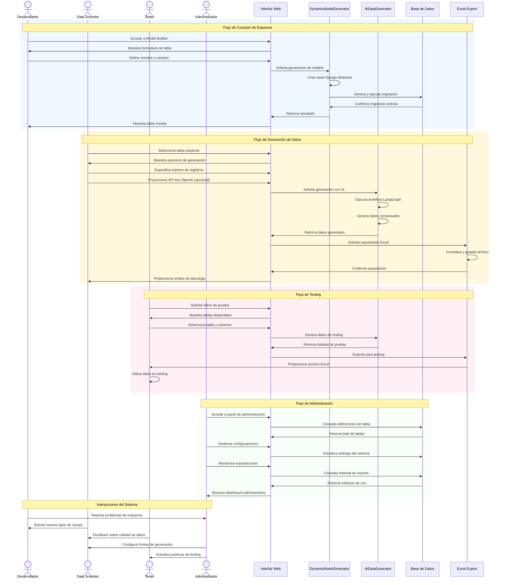

### **7.2 Flujos de Usuario Principales**

#### **7.2.1 Flujo de Creación de Tabla**
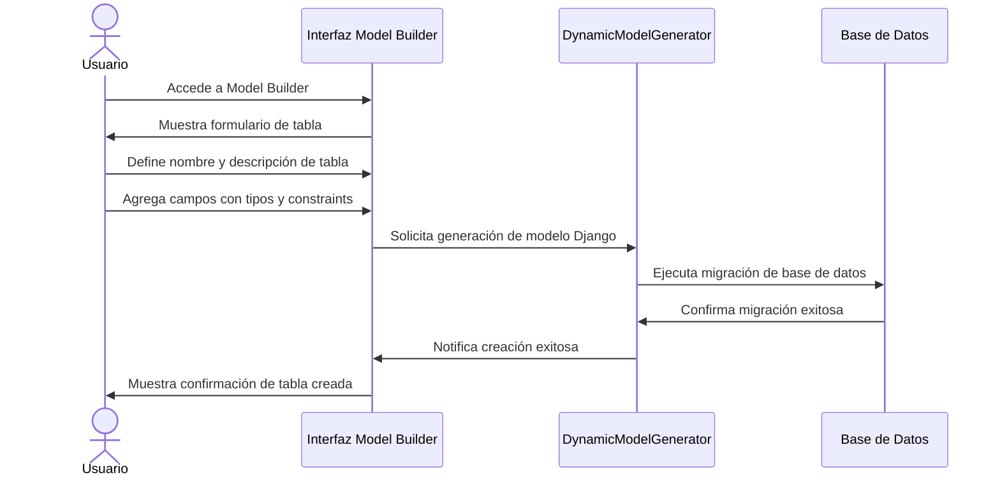

#### **7.2.2 Flujo de Generación de Datos**

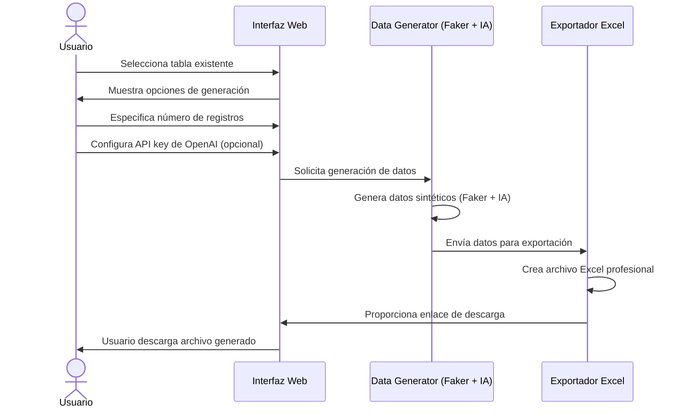

---

## **8. Suposiciones y Restricciones**

### **8.1 Suposiciones del Proyecto**

- **Disponibilidad de APIs**: Acceso confiable a APIs de OpenAI (cuando se use IA)
- **Conocimientos Básicos**: Usuarios tienen conocimientos básicos de bases de datos
- **Entorno de Desarrollo**: Proyecto se ejecuta en entornos de desarrollo/testing
- **Conectividad**: Acceso a internet para dependencias externas
- **Hardware**: Servidor con recursos suficientes para procesamiento de datos

### **8.2 Restricciones Técnicas**

- **Límite de Registros**: Máximo 10,000 registros por exportación
- **Tipos de Base de Datos**: Optimizado para SQLite (configurable para PostgreSQL/MySQL)
- **Dependencias Externas**: Requiere conexión a internet para funcionalidades de IA
- **Navegadores Soportados**: Chrome, Firefox, Safari, Edge (versiones modernas)
- **Sistema Operativo**: macOS, Linux, Windows con Python 3.8+

### **8.3 Restricciones de Alcance**

- **Alcance MVP**: Funcionalidades core sin integración con sistemas externos
- **Idiomas**: Interfaz en inglés (preparado para internacionalización)
- **Autenticación**: Sistema básico de Django (sin OAuth avanzado)
- **Monitoreo**: Logging básico sin dashboards avanzados

---

## **9. Success Metrics**

### **9.1 Technical KPIs**

| **Metric**                          | **Target Value** | **Frequency** |
|-------------------------------------|------------------|---------------|
| Generation time (1,000 records)     | < 5 seconds     | Per export    |
| Migration success rate              | > 95%           | Per migration |
| System availability                 | > 99%           | Daily         |
| User satisfaction                   | > 4.5/5         | Per quarter   |

### **9.2 Business KPIs**

| **Metric**                          | **Target Value** | **Frequency** |
|-------------------------------------|------------------|---------------|
| Tables created per month            | > 50            | Monthly       |
| Datasets exported per month         | > 200           | Monthly       |
| User adoption time                  | < 30 minutes    | Per user      |
| Development time reduction          | > 60%           | Per project   |

### **9.3 Architectural Quality KPIs**

| **Attribute** | **Target**                | **Current Baseline** | **Measurement**             | **Architectural Insight**      |
|---------------|---------------------------|----------------------|------------------------------|--------------------------------|
| **Performance**| < 30s for 10k records    | < 45s               | CloudWatch latency          | Throughput > 1000 req/s        |
| **Availability**| 99.9% uptime             | 99.5%               | CloudWatch uptime           | MTTR < 1 hour                  |
| **Security**   | Zero incidents           | Assessment completed| Security Hub findings       | Defense in depth               |
| **Testability**| 80% coverage             | 60%                 | CodeBuild reports           | Automated testing              |

---

## **10. Plan de Implementación**

### **10.1 Fases de Desarrollo**

#### **Fase 1: Core System (Meses 1-2)**
- Configuración base de Django
- Modelos estáticos y migraciones
- Interfaz básica de administración

#### **Fase 2: Dynamic Model Generation (Meses 2-3)**
- Implementación de DynamicModelGenerator
- Sistema de migraciones automáticas
- Validación de esquemas dinámicos

#### **Fase 3: Data Generation (Meses 3-4)**
- Integración con Faker library
- Sistema básico de generación de datos
- Exportación a Excel

#### **Fase 4: AI Integration (Meses 4-5)**
- Implementación de AIDataGenerator
- LangChain/LangGraph workflows
- OpenAI API integration

#### **Fase 5: UI/UX Enhancement (Meses 5-6)**
- Interfaz web completa con Bootstrap
- HTMX para dinamismo
- Testing y optimizaciones

### **10.2 Tecnologías de Deployment**

- **Contenedor**: Docker para aislamiento
- **Orquestación**: Docker Compose para desarrollo
- **Servidor**: Gunicorn para producción
- **Proxy**: Nginx para servir estáticos
- **Base de Datos**: PostgreSQL para producción

---

## **11. Conclusión**

La plataforma **Dynamic Model Builder** representa una solución innovadora para el desafío de generación de datos sintéticos en entornos de desarrollo y testing. Su arquitectura modular, integración con IA y enfoque en la experiencia del usuario la posicionan como una herramienta esencial para equipos de desarrollo modernos.

### **Beneficios Clave:**
- ✅ **Eliminación de dependencias** de datos reales
- ✅ **Generación inteligente** con capacidades de IA
- ✅ **Interfaz intuitiva** sin conocimientos técnicos
- ✅ **Arquitectura extensible** para futuras expansiones
- ✅ **Integración perfecta** con ecosistema Django

### **Impacto Esperado:**
La implementación exitosa de esta plataforma permitirá a los equipos de desarrollo **acelerar sus ciclos de trabajo**, **mejorar la calidad de testing** y **reducir costos asociados** a la preparación de datos de prueba, contribuyendo significativamente a la eficiencia general del proceso de desarrollo de software.

---

## **12. Architecture with Observability and Monitoring**

Integrating **Firebase Analytics** as the observability solution provides a solid foundation for monitoring and continuous improvement of the **Dynamic Model Builder** system.

### **Technical Benefits:**
- ✅ **Real-Time Monitoring** of users and system activity
- ✅ **Complete Tracing** of critical operations
- ✅ **Business Metrics** aligned with objectives
- ✅ **Automated Alerts** for performance issues
- ✅ **User Behavior Analysis** for insights

### **Practical Implementation:**
- **Simple Setup**: Easy integration with Firebase SDK
- **Cost-Effective**: Free plan sufficient for MVP
- **Scalability**: Grows with application usage
- **Native Integration**: Works seamlessly with web apps

### **12.1 Solución Técnica: Firebase Analytics Integration**

El sistema implementa **Firebase Analytics** como solución principal de observabilidad, complementado con logging estructurado y métricas de aplicación.

#### **12.1.1 Configuración de Firebase:**
```python
# settings.py - Firebase Configuration
FIREBASE_CONFIG = {
    'apiKey': config('FIREBASE_API_KEY'),
    'authDomain': f"{config('FIREBASE_PROJECT_ID')}.firebaseapp.com",
    'projectId': config('FIREBASE_PROJECT_ID'),
    'storageBucket': f"{config('FIREBASE_PROJECT_ID')}.appspot.com",
    'messagingSenderId': config('FIREBASE_MESSAGING_SENDER_ID'),
    'appId': config('FIREBASE_APP_ID')
}
```

#### **12.1.2 Instrumentación en Django:**
```python
# middleware.py - Firebase Analytics Middleware
class FirebaseAnalyticsMiddleware:
    def __init__(self, get_response):
        self.get_response = get_response
        
    def __call__(self, request):
        # Track page views
        analytics.log_event('page_view', {
            'page_title': request.path,
            'page_location': request.build_absolute_uri(),
            'user_agent': request.META.get('HTTP_USER_AGENT')
        })
        
        response = self.get_response(request)
        
        # Track response metrics
        analytics.log_event('api_response', {
            'endpoint': request.path,
            'method': request.method,
            'status_code': response.status_code,
            'response_time': getattr(response, 'response_time', 0)
        })
        
        return response
```

### **12.2 Logs del Sistema**

#### **12.2.1 Logs de Aplicación:**
```python
# logging.py - Structured Logging Configuration
LOGGING = {
    'version': 1,
    'disable_existing_loggers': False,
    'formatters': {
        'structured': {
            'format': '{"timestamp": "%(asctime)s", "level": "%(levelname)s", "service": "dynamic-model-builder", "message": "%(message)s", "user_id": "%(user_id)s", "operation": "%(operation)s", "duration": "%(duration)s"}'
        }
    },
    'handlers': {
        'firebase': {
            'class': 'dynamic_model_builder.logging.FirebaseLogHandler',
            'formatter': 'structured',
            'level': 'INFO'
        }
    },
    'loggers': {
        'django': {
            'handlers': ['firebase'],
            'level': 'INFO',
            'propagate': False
        },
        'data_generator': {
            'handlers': ['firebase'],
            'level': 'INFO',
            'propagate': False
        }
    }
}
```

#### **12.2.2 Eventos de Log Específicos:**
```python
# Ejemplos de logs estructurados
logger.info("Table creation started", extra={
    'user_id': request.user.id,
    'operation': 'create_table',
    'table_name': table_name,
    'field_count': len(fields_definition)
})

logger.info("Data generation completed", extra={
    'user_id': request.user.id,
    'operation': 'generate_data',
    'table_name': table_name,
    'record_count': num_records,
    'duration': generation_time,
    'ai_used': openai_api_key is not None
})

logger.error("Migration failed", extra={
    'user_id': request.user.id,
    'operation': 'migration',
    'table_name': table_name,
    'error_type': type(e).__name__,
    'error_message': str(e)
})
```

### **12.3 Métricas de Rendimiento**

#### **12.3.1 Métricas de Usuario (Firebase Analytics):**
```javascript
// Firebase Analytics Events
// Table Creation Events
firebase.analytics().logEvent('table_created', {
  table_name: tableName,
  field_count: fields.length,
  has_ai_description: fields.some(f => f.ai_description),
  creation_time: performance.now()
});

// Data Generation Events
firebase.analytics().logEvent('data_generated', {
  table_name: tableName,
  record_count: numRecords,
  generation_method: aiEnabled ? 'ai' : 'faker',
  export_format: 'excel',
  generation_time: endTime - startTime
});

// Error Events
firebase.analytics().logEvent('error_occurred', {
  error_type: error.name,
  error_message: error.message,
  component: 'data_generator',
  user_action: currentAction
});
```

#### **12.3.2 Métricas de Sistema (Custom):**
```python
# metrics.py - System Metrics
class SystemMetrics:
    @staticmethod
    def record_table_creation_metrics(table_name, field_count, duration):
        analytics.log_event('table_creation_metrics', {
            'table_name': table_name,
            'field_count': field_count,
            'duration_ms': duration,
            'timestamp': datetime.now().isoformat()
        })
    
    @staticmethod
    def record_data_generation_metrics(table_name, record_count, method, duration):
        analytics.log_event('data_generation_metrics', {
            'table_name': table_name,
            'record_count': record_count,
            'generation_method': method,
            'duration_ms': duration,
            'throughput': record_count / (duration / 1000),  # records per second
            'timestamp': datetime.now().isoformat()
        })
    
    @staticmethod
    def record_error_metrics(error_type, component, user_id=None):
        analytics.log_event('error_metrics', {
            'error_type': error_type,
            'component': component,
            'user_id': user_id,
            'timestamp': datetime.now().isoformat()
        })
```

### **12.4 Tracing y Seguimiento**

#### **12.4.1 Tracing de Solicitudes:**
```python
# tracing.py - Request Tracing
class RequestTracer:
    def __init__(self, request):
        self.request = request
        self.trace_id = str(uuid.uuid4())
        self.start_time = time.time()
        
    def start_operation(self, operation_name):
        analytics.log_event('operation_started', {
            'trace_id': self.trace_id,
            'operation': operation_name,
            'user_id': getattr(self.request.user, 'id', None),
            'timestamp': datetime.now().isoformat()
        })
    
    def end_operation(self, operation_name, success=True, error=None):
        duration = (time.time() - self.start_time) * 1000  # ms
        
        analytics.log_event('operation_completed', {
            'trace_id': self.trace_id,
            'operation': operation_name,
            'duration_ms': duration,
            'success': success,
            'error_type': type(error).__name__ if error else None,
            'error_message': str(error) if error else None,
            'timestamp': datetime.now().isoformat()
        })
```

#### **12.4.2 Tracing de IA (LangGraph):**
```python
# ai_tracing.py - AI Workflow Tracing
class AITracer:
    def trace_ai_workflow(self, field_name, field_type, ai_description):
        trace_id = str(uuid.uuid4())
        
        # Trace AI analysis phase
        analytics.log_event('ai_analysis_started', {
            'trace_id': trace_id,
            'field_name': field_name,
            'field_type': field_type,
            'description_length': len(ai_description)
        })
        
        # Trace generation phase
        analytics.log_event('ai_generation_started', {
            'trace_id': trace_id,
            'field_name': field_name
        })
        
        # Trace validation phase
        analytics.log_event('ai_validation_completed', {
            'trace_id': trace_id,
            'field_name': field_name,
            'validation_success': True
        })
        
        return trace_id
```

### **12.5 Dashboard de Observabilidad**

#### **12.5.1 Firebase Analytics Dashboard:**
```javascript
// Firebase Analytics Custom Dashboard
// Key metrics to track:
const keyMetrics = [
    'table_creation_count',
    'data_generation_count', 
    'average_generation_time',
    'error_rate',
    'user_engagement_time',
    'feature_adoption_rate'
];

// Custom audiences
const userSegments = [
    'power_users',      // > 10 tables created
    'ai_users',         // Uses AI features
    'frequent_generators', // > 1000 records generated
    'testers'          // Uses for testing purposes
];
```

#### **12.5.2 Métricas de Negocio:**
```python
# business_metrics.py
class BusinessMetrics:
    def track_user_journey(self, user_id, action, metadata=None):
        """Track complete user journey"""
        analytics.log_event('user_journey', {
            'user_id': user_id,
            'action': action,
            'step_number': self.get_journey_step(action),
            'metadata': metadata or {},
            'timestamp': datetime.now().isoformat()
        })
    
    def track_feature_usage(self, user_id, feature_name, usage_count=1):
        """Track feature adoption and usage"""
        analytics.log_event('feature_usage', {
            'user_id': user_id,
            'feature': feature_name,
            'usage_count': usage_count,
            'timestamp': datetime.now().isoformat()
        })
    
    def track_business_value(self, user_id, action_type, value_generated):
        """Track business impact metrics"""
        analytics.log_event('business_value', {
            'user_id': user_id,
            'action_type': action_type,
            'value_generated': value_generated,
            'timestamp': datetime.now().isoformat()
        })
```

### **12.6 Alertas y Monitoreo**

#### **12.6.1 Alertas Automáticas:**
```python
# alerts.py - Automated Alerts
class AlertManager:
    def check_performance_thresholds(self):
        """Check if performance metrics exceed thresholds"""
        # Check table creation time
        if self.get_average_creation_time() > 30000:  # 30 seconds
            self.send_alert('high_creation_time', {
                'current_avg': self.get_average_creation_time(),
                'threshold': 30000
            })
        
        # Check error rate
        if self.get_error_rate() > 0.05:  # 5%
            self.send_alert('high_error_rate', {
                'current_rate': self.get_error_rate(),
                'threshold': 0.05
            })
    
    def send_alert(self, alert_type, data):
        """Send alert through Firebase"""
        analytics.log_event('system_alert', {
            'alert_type': alert_type,
            'severity': self.get_alert_severity(alert_type),
            'data': data,
            'timestamp': datetime.now().isoformat()
        })
```

---

## **14. Arquitectura de Calidad y Evaluación**

### **14.1 Principios Arquitectónicos Fundamentales**

Following the principles of **Grady Booch**, the architect establishes that a "good" architecture must align with the following core elements:

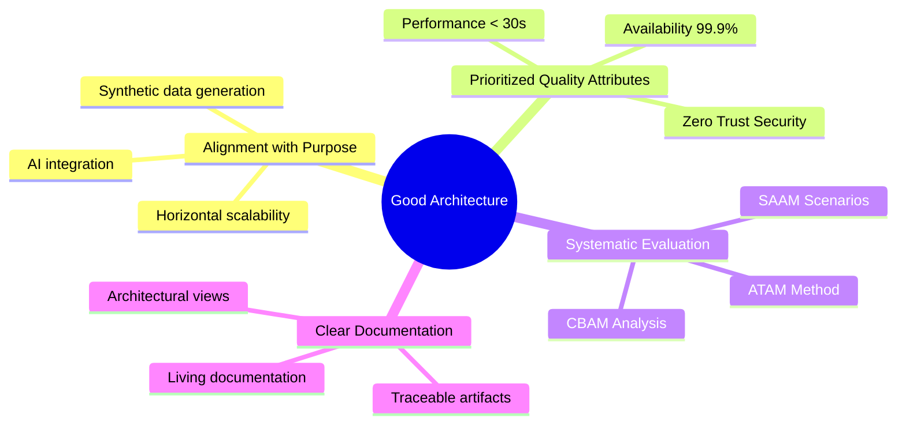

### **14.2 Atributos de Calidad Priorizados**

#### **Quality Matrix for Dynamic Model Builder:**

The architect prioritizes quality attributes based on the system's requirements, ensuring that critical aspects like performance and availability receive the highest focus.

| **Attribute** | **Priority** | **Architectural Metrics** | **Application to Project** |
|-------------|---------------|-------------------------------|---------------------------|
| **Performance** | Critical | Latency, Throughput, Scalability | Generation < 30s for 10k records |
| **Availability** | Critical | MTBF, MTTR, Uptime | 99.9% uptime with auto-recovery |
| **Security** | High | Defense in Depth, Least Privilege | Input validation, CSRF protection |
| **Testability** | High | Coverage, Automation | 80% test coverage, CI/CD |
| **Usability** | Medium | Learnability, Efficiency | Onboarding < 30min |
| **Interoperability** | Medium | APIs, Standards | RESTful APIs, OpenAPI |

### **14.3 Métodos de Evaluación Arquitectónica**

The architect applies established methods to evaluate the architecture systematically.

#### **14.3.1 ATAM (Architecture Tradeoff Analysis Method)**

**Escenarios Críticos Evaluados:**

```mermaid
flowchart TD
    subgraph "Scenario 3: SQL Injection Attack"
        S3[Stimulus: Malicious input]
        S3 --> E3[Environment: Public web app]
        E3 --> R3[Response: Validation + logging]
        R3 --> Q3[Quality: Security Trade-off]
    end

    subgraph "Scenario 2: OpenAI API Failure"
        S2[Stimulus: External service down]
        S2 --> E2[Environment: Third-party dependency]
        E2 --> R2[Response: Automatic fallback]
        R2 --> Q2[Quality: Availability Trade-off]
    end

    subgraph "Scenario 1: High Load AI Generation"
        S1[Stimulus: High processing load]
        S1 --> E1[Environment: Multi-user production]
        E1 --> R1[Response: < 30s time]
        R1 --> Q1[Quality: Performance Trade-off]
    end

    classDef scenario fill:#E3F2FD,color:#000,stroke:#1976D2
    classDef stimulus fill:#FFF3E0,color:#000,stroke:#F57C00
    classDef environment fill:#F3E5F5,color:#000,stroke:#7B1FA2
    classDef response fill:#E8F5E8,color:#000,stroke:#388E3C
    classDef quality fill:#FFEBEE,color:#000,stroke:#D32F2F

    class S1,S2,S3 stimulus
    class E1,E2,E3 environment
    class R1,R2,R3 response
    class Q1,Q2,Q3 quality
```

#### **14.3.2 CBAM (Cost-Benefit Analysis Method)**

**Architectural Decisions Analysis:**

The architect evaluates key decisions using cost-benefit analysis to ensure optimal resource allocation.

| | **Benefit**                | **Cost**                    | **ROI**                              | **Recommendation**                      |
|----------------------------------|------------------------------|------------------------------|---------------------------------------|-----------------------------------------|
| Microservices vs Monolith       | Independent scalability  | Operational complexity        | 200% ROI with ECS Fargate              | Microservices for scalability       |
| SQL vs NoSQL                     | Data consistency        | Performance in complex queries | 150% ROI with PostgreSQL + replicas | PostgreSQL with read replicas            |
| Caching Strategy            | Better performance            | Risk of stale data    | 300% ROI with Redis + invalidation     | Aggressive caching with invalidation       |


#### **14.3.3 SAAM (Scenario-Based Architecture Analysis Method)**

**Modifiability Evaluation:**

The architect assesses the system's ability to accommodate changes through scenario-based analysis.

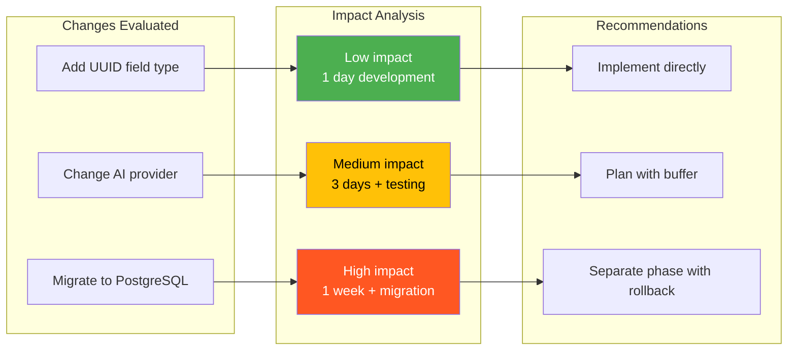

### **14.4 AWS Cloud-Native Architecture**

The architect designs the AWS cloud-native architecture to leverage cloud services for optimal performance, scalability, and cost-efficiency.

#### **14.4.1 Concise Migration Roadmap**

The architect outlines a phased migration roadmap to AWS, ensuring minimal disruption and maximum ROI.

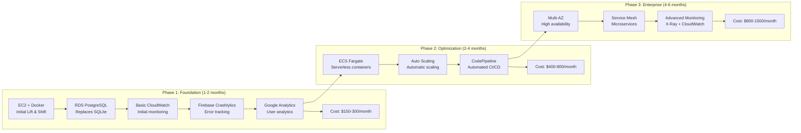

#### **14.4.2 AWS Well-Architected Framework Alignment**

The architect aligns the system with AWS Well-Architected Framework pillars to ensure best practices.

**Pillars applied to Dynamic Model Builder:**

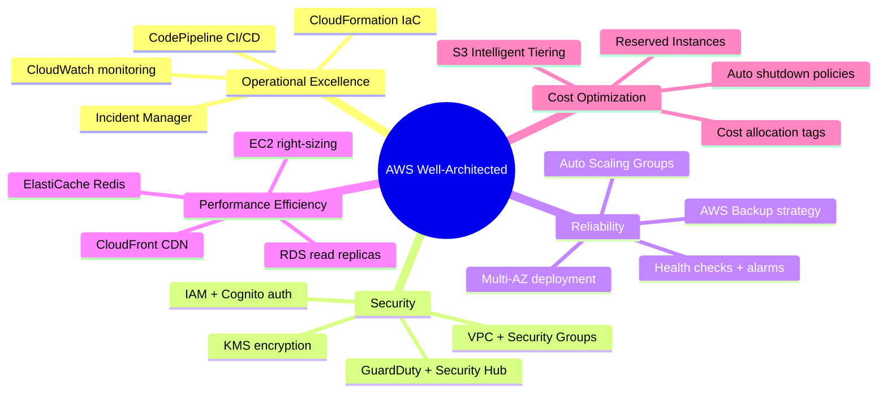

### **14.5 Métricas de Éxito Arquitectónico**

The architect defines key performance indicators to measure architectural success.

#### **14.5.1 Architectural Quality KPIs**

The architectural quality KPIs are detailed in Section 9.3, providing a comprehensive view of system performance, availability, security, and testability metrics aligned with AWS best practices.

#### **14.5.2 Continuous Evaluation**

**Quarterly continuous evaluation process:**

The architect establishes a continuous evaluation process to maintain architectural integrity.

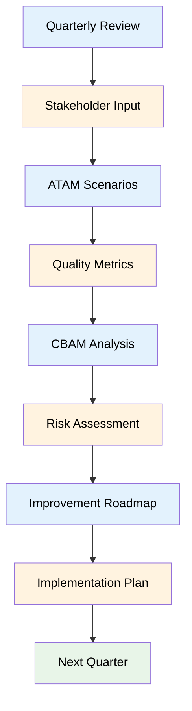

### **14.6 Recomendaciones Estratégicas**

The architect provides strategic recommendations for implementation and decision-making.

#### **14.6.1 Key Architectural Decisions**

| **Decision** | **Architectural Rationale** | **AWS Implementation** | **Risk** | **Mitigation** |
|-------------|----------------------------------|----------------------|-----------|---------------|
| **Microservices** | Independent scalability | ECS Fargate | Complexity | Service Mesh |
| **PostgreSQL** | Data consistency | RDS Multi-AZ | Performance | Read Replicas |
| **Redis Caching** | Better performance | ElastiCache | Staleness | Invalidation |
| **API Gateway** | Interoperability | Amazon API Gateway | Latency | Edge Locations |

#### **14.6.2 Next Steps**

The architect outlines the implementation roadmap.

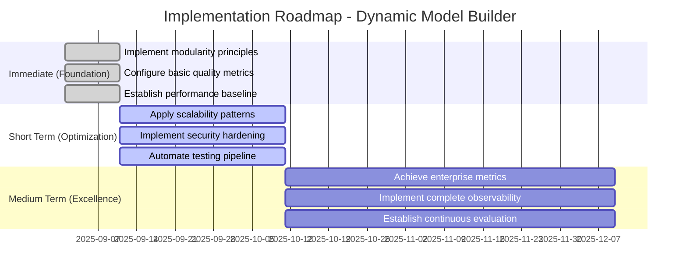

---

## **15. Integrated Architectural Conclusion**

The architect concludes that the integration of architectural principles with AWS cloud-native services provides a robust foundation for the **Dynamic Model Builder**, combining best practices in architectural evaluation with cloud scalability and reliability.

### **15.1 Prioritized Quality Attributes for Dynamic Model Builder**

Based on architectural evaluation principles, the architect identifies the most critical quality attributes for the system.

```mermaid
flowchart TD
    A[Dynamic Model Builder] --> B[Performance]
    A --> C[Availability] 
    A --> D[Security]
    A --> E[Testability]
    A --> F[Usability]
    
    B --> B1[Latency < 30s]
    B --> B2[Throughput > 1000 regs/s]
    B --> B3[Horizontal scalability]
    
    C --> C1[99.9% uptime]
    C --> C2[MTTR < 1h]
    C --> C3[Auto-recovery]
    
    D --> D1[Input validation]
    D --> D2[CSRF protection]
    D --> D3[Secure file handling]
    
    E --> E1[Test coverage > 80%]
    E --> E2[Automated testing]
    E --> E3[CI/CD integration]
    
    F --> F1[Intuitive UI]
    F --> F2[No technical knowledge required]
    F --> F3[Responsive design]
    
    classDef critical fill:#ff6b6b,color:#fff
    classDef important fill:#ffd93d,color:#000
    classDef standard fill:#6bcf7f,color:#fff
    
    class B,C critical
    class D,E important
    class F standard
```

### **15.2 Architectural Evaluation with ATAM**

The architect applies the ATAM method to evaluate critical quality scenarios.

#### **Critical Quality Scenarios:**

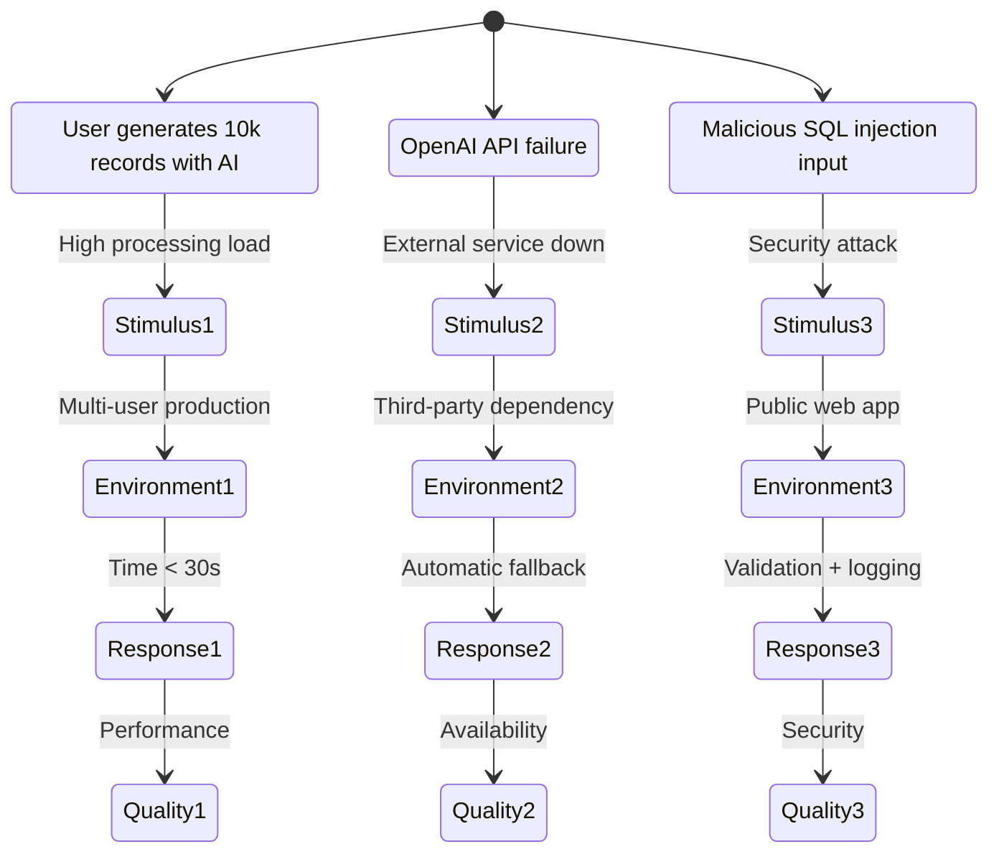

#### **Identified Architectural Trade-offs:**

| **Architectural Decision** | **Benefit** | **Trade-off** | **AWS Mitigation** |
|----------------------------|---------------|---------------|-------------------|
| **Microservices vs Monolith** | Independent scalability | Operational complexity | ECS Fargate + Service Mesh |
| **SQL vs NoSQL** | Data consistency | Performance in complex queries | PostgreSQL + Read Replicas |
| **Aggressive caching** | Better performance | Data staleness risk | Redis + Cache invalidation |
| **Serverless vs EC2** | Variable cost | Cold starts | Provisioned concurrency |

### **15.3 Applied Design Best Practices**

The architect incorporates best design practices to ensure system robustness.

#### **Architectural Design Principles:**

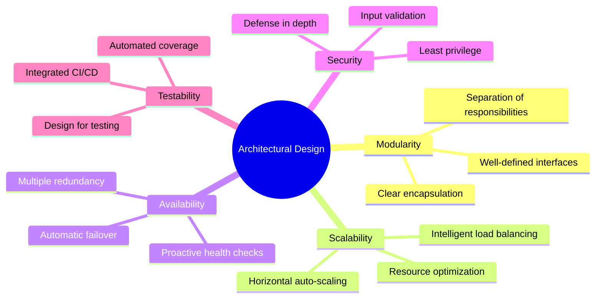

### **15.4 Architectural Quality Metrics**

The architect designs a dashboard for monitoring architectural quality metrics.

#### **Architectural Metrics Dashboard:**

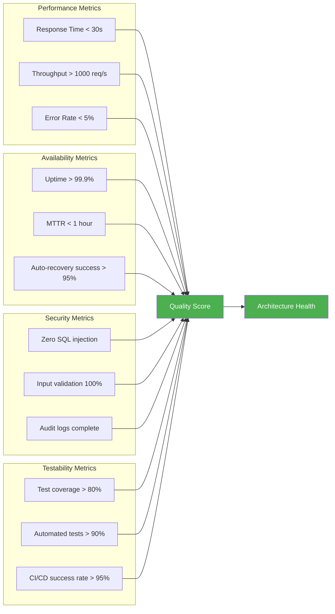

### **15.5 Implementation Recommendations**

The architect provides phased implementation recommendations.

#### **Phase 1: Foundation (Immediate)**
- ✅ Implement modularity principles
- ✅ Configure basic quality metrics
- ✅ Establish performance baseline

#### **Phase 2: Optimization (3 months)**
- ✅ Apply scalability patterns
- ✅ Implement security hardening
- ✅ Automate testing pipeline

#### **Phase 3: Excellence (6 months)**
- ✅ Achieve enterprise metrics
- ✅ Implement complete observability
- ✅ Establish continuous evaluation

### **Integrated Architectural Benefits:**

The architect highlights the integrated benefits of the architectural approach.

#### **15.6 System Quality:**
- ✅ **Systematic Evaluation** with ATAM, CBAM and SAAM
- ✅ **Prioritized Quality Attributes** according to business needs
- ✅ **Evolutionary Architecture** from initial EC2 to complete serverless
- ✅ **Continuous Monitoring** of quality metrics

#### **15.7 Operational Efficiency:**
- ✅ **AWS Well-Architected Framework** as best practices guide
- ✅ **Gradual Migration** with measurable ROI in each phase
- ✅ **Complete Automation** with IaC and CI/CD
- ✅ **Cost Optimization** with managed services

#### **15.8 Scalability and Reliability:**
- ✅ **Auto-scaling** based on real demand
- ✅ **Multi-AZ Deployment** for high availability
- ✅ **Automated Disaster Recovery**
- ✅ **Performance Optimization** with CDN and caching

### **Strategic Implementation:**

The architect emphasizes that the resulting architecture combines solid architectural evaluation principles with AWS cloud-native services, enabling the **Dynamic Model Builder** to evolve from an initial EC2-based solution to a fully scalable and reliable enterprise platform.

---

*Documento actualizado el: 31 de agosto de 2025*
*Versión: 1.4 - Arquitectura Concisa y Profesional*
*Autor: Sistema de Análisis Arquitectónico*
