# **Dynamic Model Builder - Synthetic Data Generation Platform**

---

## **1. Introducción al Proyecto**

### **1.1 Contexto del Caso de Estudio**
En la era del Big Data y el Machine Learning, la **generación de datos sintéticos de alta calidad** se ha convertido en un componente esencial para el desarrollo y testing de aplicaciones. El proyecto **Dynamic Model Builder** aborda el desafío crítico de crear datasets realistas para desarrollo, testing y análisis de datos sin comprometer la privacidad ni requerir acceso a datos sensibles.

Los métodos tradicionales de generación de datos de prueba basados en scripts manuales o datos estáticos han demostrado ser **ineficientes, poco realistas y difíciles de mantener**. Estos problemas afectan directamente la calidad del desarrollo de software, la validación de modelos de ML y la capacidad de escalar proyectos de datos.


### **1.2 Justificación del Proyecto**
La implementación de una plataforma de generación de datos sintéticos aporta beneficios significativos en múltiples áreas:

1. **Eficiencia en Desarrollo:**
   - Eliminación de dependencias de datos reales para testing
   - Aceleración de ciclos de desarrollo y testing
   - Reducción de costos asociados a preparación de datos

2. **Calidad de Datos:**
   - Generación de datos realistas con Faker library
   - Integración de IA para datos contextuales específicos
   - Validación automática de constraints y formatos

3. **Escalabilidad y Flexibilidad:**
   - Creación dinámica de esquemas de base de datos
   - Soporte para múltiples tipos de datos y formatos
   - Arquitectura modular para extensiones futuras

La plataforma busca no solo **resolver los problemas actuales** de generación de datos, sino también **posicionar al proyecto como referente** en la generación inteligente de datos sintéticos.

### **1.3 Propósito del Sistema**
El propósito del sistema es **desarrollar una plataforma web completa** que permita a desarrolladores, data scientists y testers crear bases de datos dinámicas con datos sintéticos realistas, integrando capacidades de IA para generación contextual y exportando resultados en formatos profesionales.

---

## **2. Objetivos del Proyecto**

### **2.1 Objetivo General**
Desarrollar una **plataforma web integral de generación de datos sintéticos** que permita crear esquemas de base de datos dinámicos, generar datos realistas con capacidades de IA y exportar resultados en formatos profesionales, mejorando la eficiencia en desarrollo y testing de aplicaciones.


### **2.2 Objetivos Específicos (SMART)**


---

## **3. Arquitectura del Sistema**

### **3.1 Patrón Arquitectónico Principal**
El sistema implementa una **arquitectura MVC (Model-View-Controller) con Service Layer**, siguiendo las mejores prácticas de Django y patrones de diseño modernos.

```python
# Arquitectura en Capas:
┌─────────────────┐    ┌──────────────────┐    ┌─────────────────┐
│   Templates     │    │     Views        │    │   Services      │
│   (Presentation)│◄──►│  (Controllers)   │◄──►│  (Business      │
│                 │    │                  │    │    Logic)       │
└─────────────────┘    └──────────────────┘    └─────────────────┘
                              │
                              ▼
                       ┌──────────────────┐
                       │    Models        │
                       │   (Data Layer)    │
                       └──────────────────┘
```

### **3.2 Componentes Arquitectónicos Principales**

#### **3.2.1 Capa de Presentación (Frontend)**
- **Framework**: Bootstrap 5 + HTMX + Vanilla JavaScript
- **Características**:
  - Interfaz responsive y moderna
  - Formularios dinámicos con HTMX
  - Validación en tiempo real
  - Experiencia de usuario intuitiva

#### **3.2.2 Capa de Aplicación (Backend)**
- **Framework**: Django 5.2.5
- **Componentes**:
  - **Views**: Controladores de la lógica de presentación
  - **Models**: Definición de datos y metadata
  - **Services**: Lógica de negocio especializada

#### **3.2.3 Capa de Servicios (Business Logic)**
- **DynamicModelGenerator**: Generador de modelos Django en runtime
- **AIDataGenerator**: Servicio de IA con LangChain/LangGraph
- **Excel Export Service**: Generación de archivos Excel profesionales

#### **3.2.4 Capa de Datos**
- **ORM**: Django ORM con SQLite (configurable)
- **Dynamic Tables**: Tablas creadas dinámicamente por usuarios
- **Metadata Storage**: Almacenamiento de definiciones y exportaciones

### **3.3 Arquitectura de Generación Dinámica**

#### **3.3.1 Patrón Factory para Modelos**


#### **3.3.2 Sistema de Migraciones Automáticas**
- Generación automática de archivos de migración
- Ejecución segura con manejo de errores
- Rollback automático en caso de fallos

#### **3.3.3 Arquitectura de IA Integrada**


---

## **4. Análisis de Requisitos Técnicos**

### **4.1 Requisitos Funcionales**

| **ID** | **Requisito Funcional**                                              | **Prioridad** |
|--------|----------------------------------------------------------------------|---------------|
| RF-01  | Crear esquemas de base de datos dinámicos vía interfaz web.          | Alta          |
| RF-02  | Generar modelos Django automáticamente con 11 tipos de campos.       | Alta          |
| RF-03  | Ejecutar migraciones de base de datos de forma automática.           | Alta          |
| RF-04  | Generar datos sintéticos con Faker library.                          | Alta          |
| RF-05  | Integrar IA para generación contextual de datos específicos.         | Media         |
| RF-06  | Exportar datos a archivos Excel con formato profesional.             | Alta          |
| RF-07  | Gestionar historial de exportaciones y definiciones de tablas.       | Media         |
| RF-08  | Proporcionar interfaz de administración Django completa.            | Media         |
| RF-09  | Implementar sistema de validación de constraints.                    | Alta          |
| RF-10  | Gestionar errores y fallbacks en generación de datos.                | Alta          |

### **4.2 Requisitos No Funcionales**

| **ID** | **Requisito No Funcional**                  | **Descripción**                                                       |
|--------|--------------------------------------------|-----------------------------------------------------------------------|
| RNF-01 | Rendimiento                                | Generación de hasta **10,000 registros** en < 30 segundos.            |
| RNF-02 | Disponibilidad                             | Plataforma web con **99.5% uptime** en desarrollo.                    |
| RNF-03 | Seguridad                                  | Protección CSRF, validación de inputs, sanitización de datos.         |
| RNF-04 | Escalabilidad                              | Soporte para **100+ tablas dinámicas** simultáneas.                  |
| RNF-05 | Usabilidad                                 | Interfaz intuitiva sin conocimientos técnicos requeridos.            |
| RNF-06 | Mantenibilidad                             | Arquitectura modular con separación clara de responsabilidades.       |
| RNF-07 | Extensibilidad                             | Fácil adición de nuevos tipos de campos y generadores.                |
| RNF-08 | Compatibilidad                             | Funcionamiento en Python 3.8+ y navegadores modernos.                 |

### **4.3 Requisitos de Integración**

| **ID** | **Servicio Externo** | **Propósito**                          | **Prioridad** |
|--------|---------------------|----------------------------------------|---------------|
| RI-01  | OpenAI API         | Generación contextual con IA           | Media         |
| RI-02  | Faker Library      | Generación de datos realistas          | Alta          |
| RI-03  | OpenPyXL           | Exportación a Excel                    | Alta          |
| RI-04  | LangChain          | Framework de IA y prompts              | Media         |
| RI-05  | LangGraph          | Workflows de generación de datos       | Media         |

---

## **5. Stack Tecnológico**

### **5.1 Tecnologías Core**

| **Categoría**      | **Tecnología**          | **Versión** | **Propósito**                          |
|-------------------|------------------------|-------------|----------------------------------------|
| **Backend**       | Django                | 5.2.5      | Framework web principal                |
| **Lenguaje**      | Python               | 3.13+      | Lenguaje de programación               |
| **Base de Datos** | SQLite               | 3.x        | Base de datos (configurable)           |
| **ORM**           | Django ORM           | -          | Mapeo objeto-relacional               |

### **5.2 Tecnologías de IA y Datos**

| **Categoría**      | **Tecnología**          | **Versión** | **Propósito**                          |
|-------------------|------------------------|-------------|----------------------------------------|
| **IA Framework**  | LangChain             | 0.3.14     | Integración con modelos de IA          |
| **Workflows**     | LangGraph             | 0.2.51     | Orquestación de flujos de IA           |
| **IA Provider**   | OpenAI API            | 1.58.1     | Servicio de IA para generación         |
| **Data Generation**| Faker                | 37.5.3     | Generación de datos sintéticos         |
| **Excel Export**  | OpenPyXL              | 3.1.5      | Creación de archivos Excel             |

### **5.3 Tecnologías Frontend**

| **Categoría**      | **Tecnología**          | **Versión** | **Propósito**                          |
|-------------------|------------------------|-------------|----------------------------------------|
| **CSS Framework** | Bootstrap             | 5.1.3      | Framework de estilos responsive        |
| **JavaScript**    | Vanilla JS + HTMX     | -          | Interactividad y dinamismo             |
| **Icons**         | Font Awesome         | 6.0.0      | Iconografía de la interfaz             |

### **5.4 Tecnologías de Desarrollo**

| **Categoría**      | **Tecnología**          | **Versión** | **Propósito**                          |
|-------------------|------------------------|-------------|----------------------------------------|
| **Gestión Dep.**  | pip + requirements.txt| -          | Gestión de dependencias                |
| **Entorno Virtual**| venv                  | -          | Aislamiento de dependencias            |
| **Configuración** | python-decouple       | 3.8        | Gestión de variables de entorno        |
| **Extensions**    | Django Extensions     | 4.1        | Utilidades adicionales de Django       |

---

## **6. Arquitectura de Datos**

### **6.1 Modelo de Datos Estáticos**

```python
# Modelos Core del Sistema
class DynamicTableDefinition(models.Model):
    """Almacena definiciones de tablas dinámicas"""
    table_name = models.CharField(max_length=100, unique=True)
    display_name = models.CharField(max_length=200)
    description = models.TextField(blank=True)
    fields_definition = models.JSONField()
    is_migrated = models.BooleanField(default=False)
    created_at = models.DateTimeField(auto_now_add=True)

class DynamicTableExport(models.Model):
    """Registra exportaciones de datos"""
    table_definition = models.ForeignKey(DynamicTableDefinition, on_delete=models.CASCADE)
    num_records = models.PositiveIntegerField()
    status = models.CharField(max_length=20, choices=STATUS_CHOICES)
    file_path = models.CharField(max_length=500, blank=True)
    created_at = models.DateTimeField(auto_now_add=True)
```

### **6.2 Modelo de Datos Dinámicos**

```python
# Ejemplo de Tabla Dinámica Generada:
class UserProfiles(models.Model):
    """Tabla generada dinámicamente"""
    id = models.AutoField(primary_key=True)
    first_name = models.CharField(max_length=50)
    last_name = models.CharField(max_length=50)
    email = models.EmailField()
    age = models.IntegerField()
    created_at = models.DateTimeField(auto_now_add=True)
```

### **6.3 Estrategia de Almacenamiento**

- **Metadata Tables**: Almacenan definiciones y configuraciones
- **Dynamic Tables**: Tablas creadas por usuarios con esquemas personalizados
- **File Storage**: Archivos Excel en directorio `output/`
- **Configuration**: Variables de entorno para settings sensibles

---

## **7. Casos de Uso del Sistema**

### **7.1 Diagrama de Secuencia del Sistema**


### **7.2 Flujos de Usuario Principales**

#### **7.2.1 Flujo de Creación de Tabla**


#### **7.2.2 Flujo de Generación de Datos**


---

## **8. Suposiciones y Restricciones**

### **8.1 Suposiciones del Proyecto**

- **Disponibilidad de APIs**: Acceso confiable a APIs de OpenAI (cuando se use IA)
- **Conocimientos Básicos**: Usuarios tienen conocimientos básicos de bases de datos
- **Entorno de Desarrollo**: Proyecto se ejecuta en entornos de desarrollo/testing
- **Conectividad**: Acceso a internet para dependencias externas
- **Hardware**: Servidor con recursos suficientes para procesamiento de datos

### **8.2 Restricciones Técnicas**

- **Límite de Registros**: Máximo 10,000 registros por exportación
- **Tipos de Base de Datos**: Optimizado para SQLite (configurable para PostgreSQL/MySQL)
- **Dependencias Externas**: Requiere conexión a internet para funcionalidades de IA
- **Navegadores Soportados**: Chrome, Firefox, Safari, Edge (versiones modernas)
- **Sistema Operativo**: macOS, Linux, Windows con Python 3.8+

### **8.3 Restricciones de Alcance**

- **Alcance MVP**: Funcionalidades core sin integración con sistemas externos
- **Idiomas**: Interfaz en inglés (preparado para internacionalización)
- **Autenticación**: Sistema básico de Django (sin OAuth avanzado)
- **Monitoreo**: Logging básico sin dashboards avanzados

---

## **9. Success Metrics**

### **9.1 Technical KPIs**

| **Metric**                          | **Target Value** | **Frequency** |
|-------------------------------------|------------------|---------------|
| Generation time (1,000 records)     | < 5 seconds     | Per export    |
| Migration success rate              | > 95%           | Per migration |
| System availability                 | > 99%           | Daily         |
| User satisfaction                   | > 4.5/5         | Per quarter   |

### **9.2 Business KPIs**

| **Metric**                          | **Target Value** | **Frequency** |
|-------------------------------------|------------------|---------------|
| Tables created per month            | > 50            | Monthly       |
| Datasets exported per month         | > 200           | Monthly       |
| User adoption time                  | < 30 minutes    | Per user      |
| Development time reduction          | > 60%           | Per project   |

### **9.3 Architectural Quality KPIs**

| **Attribute** | **Target**                | **Current Baseline** | **Measurement**             | **Architectural Insight**      |
|---------------|---------------------------|----------------------|------------------------------|--------------------------------|
| **Performance**| < 30s for 10k records    | < 45s               | CloudWatch latency          | Throughput > 1000 req/s        |
| **Availability**| 99.9% uptime             | 99.5%               | CloudWatch uptime           | MTTR < 1 hour                  |
| **Security**   | Zero incidents           | Assessment completed| Security Hub findings       | Defense in depth               |
| **Testability**| 80% coverage             | 60%                 | CodeBuild reports           | Automated testing              |

---

## **10. Plan de Implementación**

### **10.1 Fases de Desarrollo**

#### **Fase 1: Core System (Meses 1-2)**
- Configuración base de Django
- Modelos estáticos y migraciones
- Interfaz básica de administración

#### **Fase 2: Dynamic Model Generation (Meses 2-3)**
- Implementación de DynamicModelGenerator
- Sistema de migraciones automáticas
- Validación de esquemas dinámicos

#### **Fase 3: Data Generation (Meses 3-4)**
- Integración con Faker library
- Sistema básico de generación de datos
- Exportación a Excel

#### **Fase 4: AI Integration (Meses 4-5)**
- Implementación de AIDataGenerator
- LangChain/LangGraph workflows
- OpenAI API integration

#### **Fase 5: UI/UX Enhancement (Meses 5-6)**
- Interfaz web completa con Bootstrap
- HTMX para dinamismo
- Testing y optimizaciones

### **10.2 Tecnologías de Deployment**

- **Contenedor**: Docker para aislamiento
- **Orquestación**: Docker Compose para desarrollo
- **Servidor**: Gunicorn para producción
- **Proxy**: Nginx para servir estáticos
- **Base de Datos**: PostgreSQL para producción

---

## **11. Conclusión**

La plataforma **Dynamic Model Builder** representa una solución innovadora para el desafío de generación de datos sintéticos en entornos de desarrollo y testing. Su arquitectura modular, integración con IA y enfoque en la experiencia del usuario la posicionan como una herramienta esencial para equipos de desarrollo modernos.

### **Beneficios Clave:**
- ✅ **Eliminación de dependencias** de datos reales
- ✅ **Generación inteligente** con capacidades de IA
- ✅ **Interfaz intuitiva** sin conocimientos técnicos
- ✅ **Arquitectura extensible** para futuras expansiones
- ✅ **Integración perfecta** con ecosistema Django

### **Impacto Esperado:**
La implementación exitosa de esta plataforma permitirá a los equipos de desarrollo **acelerar sus ciclos de trabajo**, **mejorar la calidad de testing** y **reducir costos asociados** a la preparación de datos de prueba, contribuyendo significativamente a la eficiencia general del proceso de desarrollo de software.

---

## **12. Observability and Monitoring to Continuous Improvement**

Integrating **Firebase Analytics** as the observability solution provides a solid foundation for monitoring and continuous improvement of the **Dynamic Model Builder** system.

### **12.3 Performance Metrics Collection**


### **12.6 Observability Dashboard Structure**

```mermaid
mindmap
  root((Observability Dashboard))
    Key Metrics
      Table Creation Count
      Data Generation Count
      Avg Generation Time
      Error Rate
      User Engagement Time
      Feature Adoption Rate
    User Segments
      Power Users (>10 tables)
      AI Users (uses AI features)
      Frequent Generators (>1000 records)
      Testers (testing use)
    Alerts
      High Creation Time
      High Error Rate
      System Performance Issues
```



### **12.7 Automated Alerts and Monitoring**


## **12. Horizontal Scalation with Distributed Systems Architecture Integration**

This section integrates advanced distributed systems patterns to ensure the **Dynamic Model Builder** can handle increased load and provide high availability.

#### **Load Balancing Architecture:**
Monolithic application is transformed into a distributed system with a load balancer distributing requests to multiple worker nodes.

Turn on it when the system needs to handle high traffic or large data generation requests.


## **13. Upgrade Architecture to Microservices on AWS Cloud-Native**

### **13.1 Aspects to Consider for Apply the next Architecture**


### **14.2 Focus on Quality Attributes**

#### **Quality Matrix for Dynamic Model Builder:**

The new architect prioritizes quality attributes based on the system's requirements, ensuring that critical aspects like performance and availability receive the highest focus.

| **Attribute** | **Priority** | **Architectural Metrics** | **Application to Project** |
|-------------|---------------|-------------------------------|---------------------------|
| **Performance** | Critical | Latency, Throughput, Scalability | Generation < 30s for 10k records |
| **Availability** | Critical | MTBF, MTTR, Uptime | 99.9% uptime with auto-recovery |
| **Security** | High | Defense in Depth, Least Privilege | Input validation, CSRF protection |
| **Testability** | High | Coverage, Automation | 80% test coverage, CI/CD |
| **Usability** | Medium | Learnability, Efficiency | Onboarding < 30min |
| **Interoperability** | Medium | APIs, Standards | RESTful APIs, OpenAPI |

#### **14.3.1 ATAM (Architecture Tradeoff Analysis Method)**

**Escenarios Críticos para evaluar aplicat una nueva arquitectura:**


#### **14.3.2 CBAM (Cost-Benefit Analysis Method)**

**Architectural Decisions Analysis:**

The architect evaluates key decisions using cost-benefit analysis to ensure optimal resource allocation.

| | **Benefit**                | **Cost**                    | **ROI**                              | **Recommendation**                      |
|----------------------------------|------------------------------|------------------------------|---------------------------------------|-----------------------------------------|
| Microservices vs Monolith       | Independent scalability  | Operational complexity        | 200% ROI with ECS Fargate              | Microservices for scalability       |
| SQL vs NoSQL                     | Data consistency        | Performance in complex queries | 150% ROI with PostgreSQL + replicas | PostgreSQL with read replicas            |
| Caching Strategy            | Better performance            | Risk of stale data    | 300% ROI with Redis + invalidation     | Aggressive caching with invalidation       |


#### **14.3.3 SAAM (Scenario-Based Architecture Analysis Method)**

**Modifiability Evaluation:**

The architect assesses the system's ability to accommodate changes through scenario-based analysis.


### **14.4 AWS Cloud-Native Architecture**

The architect designs the AWS cloud-native architecture to leverage cloud services for optimal performance, scalability, and cost-efficiency.

#### **14.4.1 Concise Migration Roadmap**

The architect outlines a phased migration roadmap to AWS, ensuring minimal disruption and maximum ROI.


#### **14.4.2 AWS Well-Architected Framework Alignment**

The architect aligns the system with AWS Well-Architected Framework pillars to ensure best practices.

**Pillars applied to Dynamic Model Builder:**


### **14.5 Métricas de Éxito Arquitectónico**

The architect defines key performance indicators to measure architectural success.

#### **14.5.1 Architectural Quality KPIs**

The architectural quality KPIs are detailed in Section 9.3, providing a comprehensive view of system performance, availability, security, and testability metrics aligned with AWS best practices.

#### **14.5.2 Continuous Evaluation**

**Quarterly continuous evaluation process:**

The architect establishes a continuous evaluation process to maintain architectural integrity.


### **14.6 Recomendaciones Estratégicas**

The architect provides strategic recommendations for implementation and decision-making.

#### **14.6.1 Key Architectural Decisions**

| **Decision** | **Architectural Rationale** | **AWS Implementation** | **Risk** | **Mitigation** |
|-------------|----------------------------------|----------------------|-----------|---------------|
| **Microservices** | Independent scalability | ECS Fargate | Complexity | Service Mesh |
| **PostgreSQL** | Data consistency | RDS Multi-AZ | Performance | Read Replicas |
| **Redis Caching** | Better performance | ElastiCache | Staleness | Invalidation |
| **API Gateway** | Interoperability | Amazon API Gateway | Latency | Edge Locations |

#### **14.6.2 Next Steps**

The architect outlines the implementation roadmap.


---

## **15. Migrate to Microservices on AWS Cloud-Native Architecture**

The architect concludes with a practical migration guide: how to move the current monolithic Django-based Dynamic Model Builder to a microservices, AWS cloud-native architecture while preserving the same quality attributes and evaluation context described earlier.

Below we keep the same graphs and quality context but annotate each item with the concrete AWS services, migration actions and verification steps required to execute a safe, incremental migration.

### **15.1 Prioritized Quality Attributes for Dynamic Model Builder (annotated for AWS migration)**

Based on the same evaluation, this section maps each quality attribute to target AWS primitives and short migration actions.


Mapping notes (how each node maps to AWS during migration):
- Performance (B): API Gateway + ALB, ECS Fargate / EKS for services, ElastiCache (Redis) for caching, RDS (Postgres) read replicas for heavy reads.
- Availability (C): Multi-AZ RDS, ECS with ALB + Auto Scaling, Route53 health checks, CloudWatch alarms and AWS Backup for recovery.
- Security (D): AWS IAM + least-privilege roles, AWS WAF, Secrets Manager / Parameter Store, S3 for safe file storage with SSE.
- Testability (E): CodeBuild/CodePipeline for CI, CodeDeploy or GitHub Actions for deployments, X-Ray + CloudWatch Logs for observability and automated integration tests.
- Usability (F): CloudFront + S3 for static assets, Cognito for auth (or existing Django auth behind a service), and gradual frontend decoupling behind APIs.

### **15.2 Architectural Evaluation with ATAM — migration-focused scenarios**

Keep the original critical scenarios, but add AWS migration responses and fallback patterns.


Migration reactions and AWS patterns:
- High processing load: offload heavy generation to asynchronous workers (ECS/EKS tasks or Lambda for small units) behind SQS/EventBridge. Use autoscaling policies (Target Tracking) and provisioned concurrency for critical Lambdas.
- Third-party API failures: implement Circuit Breaker and retry patterns using Step Functions or custom middleware; mirror critical prompt templates in S3 and provide degraded local generators (Faker) when OpenAI is unavailable.
- Security attacks: terminate risky inputs at API Gateway / WAF level, enforce input sanitization in each service, centralize audit logs in CloudWatch Logs + Athena for forensic queries.

#### Identified Trade-offs (migration-centric)

| Decision | Migration Benefit | Trade-off during migration | AWS Mitigation |
|---|---:|---|---|
| Break monolith into microservices | Independent scaling and faster releases | Increased operational surface and SRE burden during migration | Start with containerized monolith on ECS Fargate, add service mesh (App Mesh) and progressive traffic shifting |
| Centralized SQL DB -> distributed services | Maintain data consistency | Cross-service transactions complexity | Use RDS (Postgres) + read replicas; implement saga patterns and DynamoDB for specific event-sourced pieces |
| Aggressive caching | Lower latency | Risk of stale data across services | Use ElastiCache + consistent cache invalidation via events (EventBridge/SNS) |
| Serverless for bursty workloads | Cost effective and auto-scaling | Cold start / operational difference | Use provisioned concurrency, Lambda@s, and containerized workers for steady workloads |

### **15.3 Applied Design Best Practices — migration checklist**

Use the same principles but add concrete migration contracts:
- Modularity: define service boundaries (API surface, data ownership), small set of bounded contexts to extract first (e.g., Model Definition service, Data Generation service, Export service).
- Scalability: design each service to scale independently with autoscaling groups or Fargate task scaling rules.
- Availability: use Multi-AZ deployments and stateless services with externalized sessions (DynamoDB or ElastiCache).
- Security: apply least-privilege IAM roles per service, use KMS for encryption, enable AWS WAF and Shield where public endpoints exist.
- Testability: create a CI pipeline per service with unit, integration and contract tests.

Tiny contract example (Data Generation service):
- Inputs: Table definition ID, record count, optional AI prompt.
- Outputs: S3 path to generated file / DB insert confirmations.
- Errors: Retries on transient failures, poison queue handling to Dead Letter Queue (DLQ).

### **15.4 Architectural Quality Metrics — AWS instrumentation**

The dashboard stays the same; implementations change to AWS telemetry:
- Response time & throughput: CloudWatch metrics for API Gateway/ALB and ECS/EKS service metrics.
- Error rate & auto-recovery: CloudWatch Alarms + EventBridge to trigger auto-remediation (e.g., scale up, restart tasks).
- Security: AWS Config, GuardDuty, CloudTrail logs aggregated to CloudWatch and analyzed by Athena/QuickSight.
- Testability: CodeBuild reports and CodePipeline success rate.

```mermaid
flowchart LR
    subgraph "Performance Metrics"
        P1[Response Time < 30s]
        P2[Throughput > 1000 req/s]
        P3[Error Rate < 5%]
    end
    
    subgraph "Availability Metrics"
        A1[Uptime > 99.9%]
        A2[MTTR < 1 hour]
        A3[Auto-recovery success > 95%]
    end
    
    subgraph "Security Metrics"
        S1[Zero SQL injection]
        S2[Input validation 100%]
        S3[Audit logs complete]
    end
    
    subgraph "Testability Metrics"
        T1[Test coverage > 80%]
        T2[Automated tests > 90%]
        T3[CI/CD success rate > 95%]
    end

    P1 --> M[Quality Score]
    P2 --> M
    P3 --> M
    A1 --> M
    A2 --> M
    A3 --> M
    S1 --> M
    S2 --> M
    S3 --> M
    T1 --> M
    T2 --> M
    T3 --> M

    M --> R[Architecture Health]
```

### **15.5 Step-by-step Migration Plan (Monolith -> Microservices on AWS)**

Phase A — Prepare and Stabilize (weeks 0–2)
- Inventory: catalog Django views, models, DB tables and export workflows; identify bounded contexts (ModelDefinition, Generation, Export, Admin).
- Containerize: package current monolith as a Docker image and deploy to ECS Fargate behind an Application Load Balancer (ALB). This provides a low-risk lift-and-shift.
- Observability baseline: enable CloudWatch Logs, X-Ray tracing, and basic metrics for the containerized monolith.

Phase B — Extract First Services (weeks 3–10)
- Extract Data Generation service: implement as an independent service (container or Lambda) that reads table definitions from RDS and writes generated artifacts to S3. Use SQS or EventBridge for generation requests.
- Extract Export service: handle Excel formatting and storage — move file writes to S3, and use presigned URLs for downloads through API Gateway/ALB.
- Implement Auth boundary: front the API with Cognito or a dedicated Auth service; switch monolith traffic gradually via path-based routing on ALB or API Gateway.

Phase C — Data and State Migration (weeks 8–14)
- Schema ownership: migrate table ownership incrementally. Keep a single RDS Postgres for transactional data initially, add read replicas for scaling reads.
- Event-driven integration: add SNS/EventBridge topics to propagate changes (table created, export ready) between services; adopt idempotent consumer patterns.
- Long-term: consider moving immutable, high-throughput datasets to DynamoDB or partitioned Postgres schemas to reduce cross-service coupling.

Phase D — Harden, Automate, and Optimize (weeks 12–20)
- CI/CD: create a CodePipeline per service, with automated tests and canary/deployment strategies via CodeDeploy or ECS rolling updates.
- Observability: centralize logs in CloudWatch, add X-Ray traces, and QuickSight dashboards for the architectural metrics.
- Resilience: add SQS DLQs, Step Functions for multi-step generation workflows, and circuit-breakers around external AI providers.

Phase E — Complete Microservices and Cost Optimization (months 6+)
- Replace the containerized monolith with a composition of microservices behind API Gateway and App Mesh for service-to-service observability.
- Optimize: use Spot/Graviton EC2 or Fargate savings plans for cost; introduce RDS read-replicas and ElastiCache to hit targets.
- Governance: apply AWS Organizations, Service Control Policies and automated IaC (CloudFormation / CDK / Terraform) for reproducible environments.

Quick verification checks for each phase:
- Smoke test endpoints, measure latency and throughput in CloudWatch.
- Integration tests for event contracts between services.
- Security scan (IAM, WAF rules) and automated backups verified.

### **15.6 Integrated Architectural Benefits (post-migration)**

- System Quality: scalable services, independent release cadence, better fault isolation.
- Operational Efficiency: automated CI/CD, infra-as-code, and managed services reduce operational toil.
- Scalability & Reliability: auto-scaling, Multi-AZ RDS and ElastiCache provide the required capacity and redundancy.

### **15.7 Minimal Risk Rollout Strategy**

- Parallel run: keep monolith running while migrating features gradually. Use feature flags and path-based routing to divert a percentage of traffic to new services.
- Backout plan: each change must include an automated rollback path in CodePipeline and health checks that revert traffic on failure.
- Data safety: snapshot RDS before schema changes, use transactional migrations with backward-compatible columns and feature toggles for consumers.

### **15.8 Closing: how the graphs map to the final AWS topology**

- The quality attribute graph remains the contract (what we need to achieve). Implementation maps to AWS building blocks:
  - Performance/Throughput -> ALB/API Gateway + ECS/EKS + ElastiCache + RDS read replicas.
  - Availability/Recovery -> Multi-AZ RDS, Auto Scaling, CloudWatch Alarms, Route53 health checks.
  - Security -> IAM, KMS, Secrets Manager, WAF, CloudTrail.
  - Testability -> CodeBuild, CodePipeline, X-Ray, CloudWatch metrics.

This section should serve as the operational plan for moving from the current EC2/containerized monolith into an AWS microservices architecture while keeping the original evaluation criteria and diagrams as the migration contract and verification targets.
